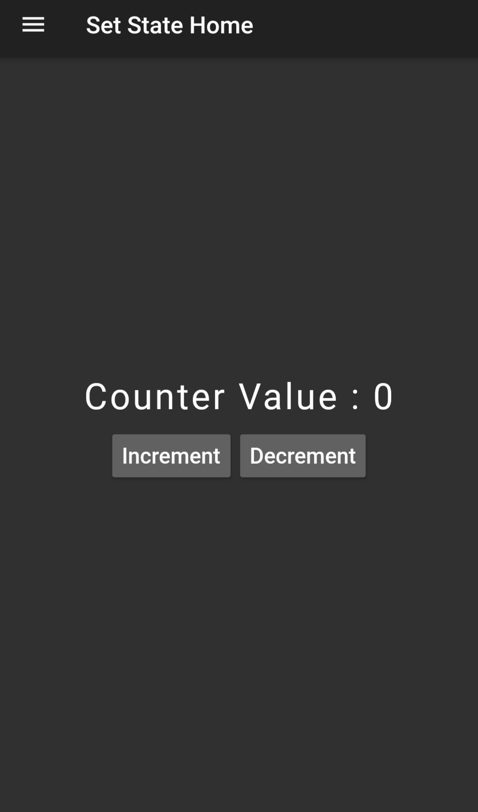
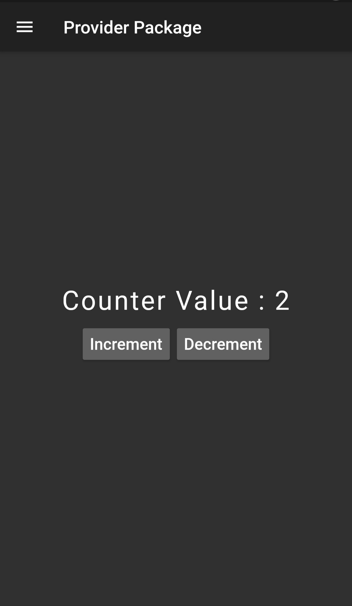
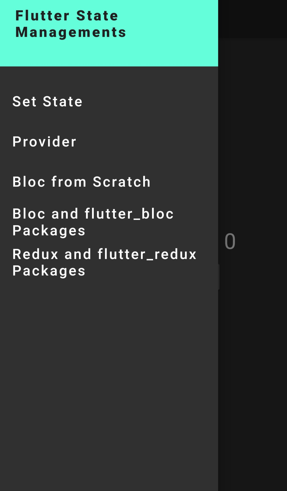

# Flutter State Management

A Demonstration of various state management techniques and architecture available in flutter.

## State Management architectures covered in this repo.

1. SetState.
2. Provider Package.
3. State Management with Bloc from Scratch (Vanilla Bloc).
4. bloc and flutter_bloc Packages.
5. redux and flutter_redux Packages.

All these are used one by one to showcase the demo code, for building increment and decrement counter seperately.

<table>
  <tr>
     <td>Set State Home</td>
     <td>Provider Home</td>
     <td>Drawer</td>
  </tr>
  <tr>
    <td valign="top"></td>
    <td valign="top"></td>
    <td valign="top"></td>
  </tr>
 </table>